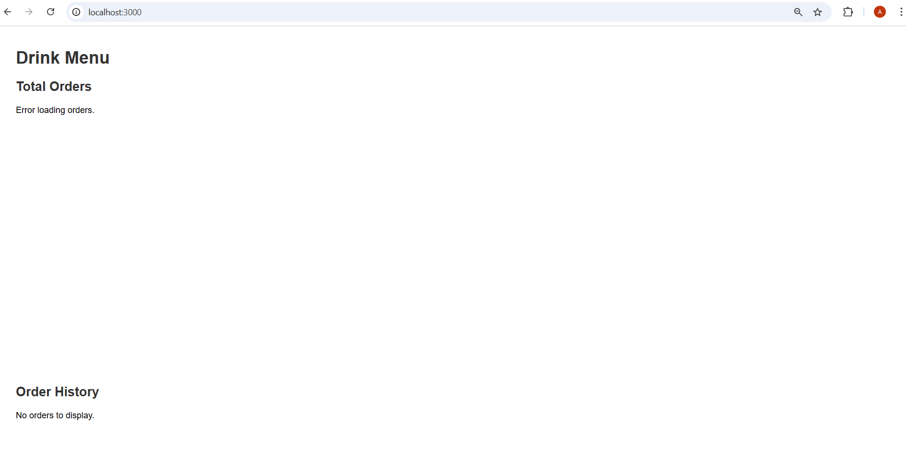
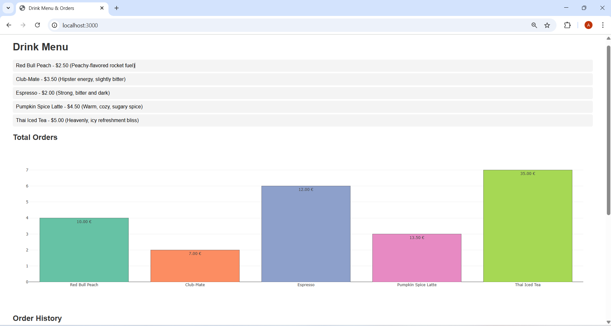
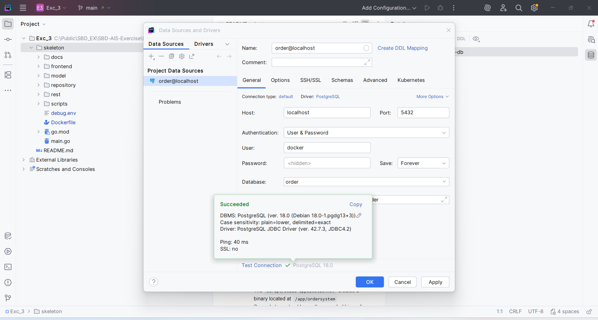
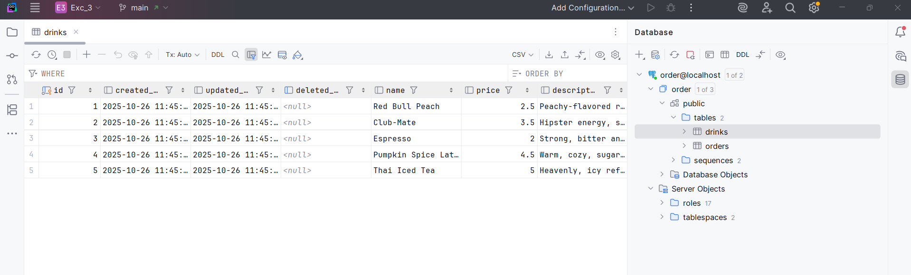
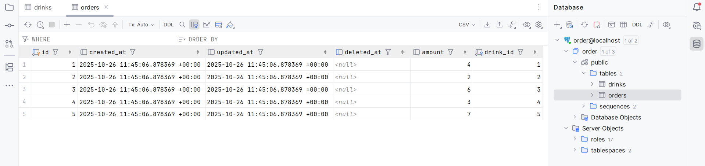

# Exercise 3: Docker containerization 🐳

**Task Description:** This exercise focuses on containerization of software. We are going to put the HTTP server from Exercise 2 into a Docker container, using a multi-stage Dockerfile.  
We are also going to add a PostgreSQL database to this project. The database shall be started as a docker container.

## 1. Introduction
**What is Docker for:**  
Docker packages the code, dependencies, and environment into a container.
A container is like a lightweight virtual computer - it runs the program exactly the same way everywhere.


In this project I'll have:  
- **1 container for PostgreSQL** (the database)  
- **1 container for the Go Ordersystem** (your HTTP server)  

They’ll communicate using environment variables.


## 2. Project Structure Overview 

I'll work inside `Ex3/skeleton`, which contains:
```lua
Dockerfile         <-- will build our Go application container
debug.env          <-- defines environment variables for DB and app
scripts/           <-- contains build-application.sh
repository/        <-- has db.go (database logic)
model/             <-- Go models
rest/              <-- API routes
frontend/          <-- static files
main.go            <-- main entry point
```

The goal is to containerize everything.


## 3. Starting PostgreSQL in a Docker Container
**Why?**  
Because we need a running database to store and retrieve data for the Go app.

### Ubuntu Terminal (*used for the whole assignment*):

#### Step 1: Navigating to the correct folder
```bash
cd /mnt/c/Public/SBD_EX/SBD-AIS-Exercise/Exc_3/skeleton
```
- In linux we need the forward slash in the path structure as well as a `mnt` (= mount)

#### Step 2: Creating a Docker volume
```bash
docker volume create pgdata_sbd
```
- A volume keeps the database data safe even if the container is deleted.

#### Step 3: Starting the PostgreSQL container
```bash
docker run -d \
  --name ordersystem-db \
  --env-file debug.env \
  -v pgdata_sbd:/var/lib/postgresql/18/docker \
  -p 5432:5432 \
  postgres:18
```
- `-d` = run in background  
- `--name ordersystem-db` = name for the container  
- `--env-file debug.env` = loads DB credentials  
- `-v` = connects your volume for data persistence   
- `-p` = maps container port 5432 to your machine’s 5432  
- `postgres:18` = the image version we’re using

#### Step 4: Check if it's running
```bash
docker ps
```
- We should see a container named `ordersystem-db` if it worked.  


**Confirmation:** 
``` bash
annalena@DESKTOP-422LGMO:/mnt/c/Public/SBD_EX/SBD-AIS-Exercise/Exc_3/skeleton$ docker ps
CONTAINER ID   IMAGE         COMMAND                  CREATED          STATUS          PORTS                                         NAMES
7326e2dd3b78   postgres:18   "docker-entrypoint.s…"   24 seconds ago   Up 22 seconds   0.0.0.0:5432->5432/tcp, [::]:5432->5432/tcp   ordersystem-db
```

#### Step 5: Connect to the database
```bash
docker exec -it ordersystem-db psql -U docker -d order
```
- if it opens the `psql` prompt -> then my database works

**Helpful commands when using:**
```bash
You are using psql, the command-line interface to PostgreSQL.
Type:  \copyright for distribution terms
       \h for help with SQL commands
       \? for help with psql commands
       \g or terminate with semicolon to execute query
       \q to quit
```

## 4. Multi-Stage Dockerfile for Go Ordersystem

**Why use Multi-Stage?**  
We don’t want to include all Go build tools in the final image - they make it huge.  
Instead, we’ll use:
1. **Stage 1 (Builder):** Build the binary using `golang:1.25`
2. **Stage 2 (Runner):** Copy only the compiled binary into a clean `alpine` image

**Now we create the Dockerfile in /skeleton**
- `golang:1.25` is used to build your Go binary  
- `alpine` is a tiny Linux image for running it  
- create a non-root `appuser` for safety  
- The binary `ordersystem` is built and copied over  
- No Go compiler or source files are in the final image -> smaller and faster

**How to find the port my application uses:**
``` bash
grep -R --line-number "ListenAndServe" .
```
- Port: 3000 `err = http.ListenAndServe(":3000", r)`


## 5. Build and run Ordersystem Container

#### Step 1: Building the image
```bash
docker build -t orderservice .
```
- `-t orderservice` names the image  
- `.` tells Docker to use the Dockerfile in the current folder.

<br>

**!!! IMPORTANT !!!**  
Unfortunately I ran into an error here, see below.  
The problem was the **line ending**. On Windows, the `build-application.sh` file commonly has **CRLF line endings** instead of **LF**.  
That can cause "not found" even when the file exists ( because Linux interprets `./scripts/build-application.sh\r` as a different file).  

**To fix this:**  
- In VS Code, open `scripts/build-application.sh`  
- Look at the bottom-right corner -> ensure it says **LF** (not CRLF)  
- If not, click it -> choose **LF**

**Thrown error was:**
```bash 
 => ERROR [builder 6/6] RUN chmod +x scripts/build-application.sh && ./scripts/build-application.sh                0.4s
------
 > [builder 6/6] RUN chmod +x scripts/build-application.sh && ./scripts/build-application.sh:
0.408 /bin/sh: 1: ./scripts/build-application.sh: not found
------
Dockerfile:16
--------------------
  14 |
  15 |     # Run your build script (creates /app/ordersystem binary)
  16 | >>> RUN chmod +x scripts/build-application.sh && ./scripts/build-application.sh
  17 |
  18 |
--------------------
ERROR: failed to build: failed to solve: process "/bin/sh -c chmod +x scripts/build-application.sh && ./scripts/build-application.sh" did not complete successfully: exit code: 127
```

#### Step 2: Run the container (connecting to the DB)
```bash
docker run -d \
  --name orderservice \
  --env-file debug.env \
  --network host \
  orderservice
```
- Uses same environment variables as before  
- as recommended I used `--network host` for simplicity
- `--network host` lets app and DB communicate directly via `127.0.0.1`

#### Step 3: Check if both containers are running
```bash
docker ps
```
- we should see `ordersystem-db` and `orderservice`

**Looks pretty good:**
```bash
CONTAINER ID   IMAGE          COMMAND                  CREATED             STATUS             PORTS                                         NAMES
2959d76ece4e   orderservice   "./ordersystem"          21 seconds ago      Up 20 seconds                                                    orderservice
7326e2dd3b78   postgres:18    "docker-entrypoint.s…"   About an hour ago   Up About an hour   0.0.0.0:5432->5432/tcp, [::]:5432->5432/tcp   ordersystem-db
```

## 6. Script for Building and Running
So far my containers have been running manually using long `docker` commands. To be more efficient, I will **automate these steps** now with a small helper script - so I don't have to remeber or type all the commands every single time.  

**Basic idea:** we wrap everything that already works into a reusable `.sh` script -> makes the project reproducible and easy to start  

I decided to reuse the existing `run.sh` file and filled in the #todo commands.  

Then we need to **make it executable once** in the Ubuntu terminal:  
```bash
chmod +x scripts/run.sh
```

#### Cleanup
Before we can run `./scripts/run.sh` to check out if it worked, we have to delete the "old" already running containers and start fresh -> otherwise we would get an error (obviously😆)

**Error:**
```bash
docker: Error response from daemon: Conflict. The container name "/ordersystem-db" is already in use by container "7326e2dd3b78d0ccdf11a997975267fab16af76857ee89df46a87d1eac66de3b". You have to remove (or rename) that container to be able to reuse that name.

Run 'docker run --help' for more information
```

**Removing old containers:**
```bash
docker stop ordersystem-db
docker rm ordersystem-db
docker stop orderservice
docker rm orderservice
```
- run all these commands individually

**Now we can run the automated version:**
```bash
./scripts/run.sh
```
- now I can spin up my whole project just by running this command!


## 7. Verifying that everything works
After running `./scripts/run.sh` we run the command `docker ps` to check if both containers run successfully.

```bash
docker ps
```

They do - but there is one **major issue** and that is that the `orderservices` container has no address and I cannot open the app in the Browser: https://localhost:3000  

This is a **classic Windows/WSL + Docker networking issue**:
- `--network host` works **only on Linux**.  
- On Windows or WSL, it does **not allow** me to access `localhost` **from my browser**.

## 8. Fixing the ISSUE

#### Step 1: Creating a customed Docker network
This lets both my Postgres and Orderservice containers talk to each other without relying on host networking.
```bash
docker network create SBDnetwork 2>/dev/null || true
```
- `SBDnetwork` is the network name  
- `2>/dev/null || true` ignores errors if the network already exists  

#### Step 2: Stopping and removing old containers (cleanup again)
```bash
docker rm -f orderservice ordersystem-db 2>/dev/null || true
```
- This stops and removes my old containers so there’s no name conflict

#### Step 3: Starting Postgres container
```bash
docker run -d --name ordersystem-db \
  --network SBDnetwork \
  --env-file debug.env \
  -e PGDATA=/var/lib/postgresql/18/docker \
  -v pgdata_sbd:/var/lib/postgresql/18/docker \
  -p 5432:5432 \
  postgres:18
```
- `--network sbdnet` -> connects Postgres to the custom network  
- `-v pgdata_sbd:/var/lib/postgresql/18/docker` -> persistent storage  
- `-p 5432:5432` -> exposes Postgres to your Windows host so you can connect via DBeaver, VSCode, etc.  
- `-e PGDATA=...` -> ensures Postgres stores data in the volume  
- `--env-file debug.env` -> uses your existing DB credentials  

#### Step 4: Updating my `.env` for Orderservice
```env
POSTGRES_DB=order
POSTGRES_USER=docker
POSTGRES_PASSWORD=docker
POSTGRES_TCP_PORT=5432
DB_HOST=ordersystem-db
```
- `DB_HOST=ordersystem-db` instead of `127.0.0.1`  
- **Why:** On Docker networks, `localhost` inside the Orderservice container refers to itself. To reach Postgres, you must use the container name `ordersystem-db`.

#### Step 5: Starting Ordersercvice container
```bash
docker run -d --name orderservice \
  --network SBDnetwork \
  --env-file debug.env \
  -p 3000:3000 \
  orderservice
```
- Same network as Postgres -> container can talk to DB via `DB_HOST=ordersystem-db`  
- `-p 3000:3000` -> maps container port 3000 to Windows host, so you can access `http://localhost:3000`

#### Step 6: Verify everything
```bash
docker ps
```
- both ontainers should be running  
- ports should look like:  
```bash
orderservice        0.0.0.0:3000->3000/tcp  
ordersystem-db      0.0.0.0:5432->5432/tcp
```

#### Step 7: Test in Browser
```arduino
http://localhost:3000
```
- now it works on Windows without `--network host`

#### Step 8: Automation and updated `run.sh` file
This step is **optional**, given that it already ran before.  
Nevertheless, I like having a simple and easy to handle one line command instead of multiple ones that I tend to forget in order to run my application. Using `./scripts/run.sh` with an updated `run.sh` file, we can use this command to make sure everything runs smoothly.  
Here's a summary of what the updated `run.sh` does and why it's good practice:
- **Builds the Go app image** – includes the latest code  
- **Creates a Docker network** – ensures reliable container communication  
- **Cleans up old containers** – avoids name conflicts and stale data  
- **Starts DB before the app** – ensures the backend can connect without errors  

#### Step 9: Open the Browser to verify everything works - for real now 🤯



## 9. Populating the database
- The database is automatically populated with example data when the application starts  
- This happens inside the `prepopulate()` function in `db.go`  
- Therefore we have to fill in the missing data

**Drinks:**
```go
drinks := []model.Drink{
  {Name: "Red Bull Peach", Price: 2.5, Description: "Peachy-flavored rocket fuel"},
  {Name: "Club-Mate", Price: 3.5, Description: "Hipster energy, slightly bitter"},
  {Name: "Espresso", Price: 2, Description: "Strong, bitter and dark"},
  {Name: "Pumpkin Spice Latte", Price: 4.5, Description: "Warm, cozy, sugary spice"},
  {Name: "Thai Iced Tea", Price: 5.0, Description: "Heavenly, icy refreshment bliss"},
}
```
- A predefined list of drinks is created and inserted into the database using GORM  


**Orders:**
```go
orders := []model.Order{
  {DrinkID: drinks[0].ID, Amount: 4},
  {DrinkID: drinks[1].ID, Amount: 2},
  {DrinkID: drinks[2].ID, Amount: 6},
  {DrinkID: drinks[3].ID, Amount: 3},
  {DrinkID: drinks[4].ID, Amount: 7},
}
```
- Sample orders are created using only `DrinkID` and `Amount`  
- This ensures correct foreign key relationships without referencing full `Drink` structs  

**Notes:**
- Data is only inserted once (the function checks if drinks already exist)
- GORM handles table creation and data insertion automatically
- This makes the app usable immediately after running `./scripts/run.sh`, no manual setup required

**Verification that my data was inserted correctly:**  
- when we open `http://localhost:3000` in the browser, we should see the populated frontend with all our data  



## 10. Connecting the Database viewer to the DB
**Chosen DB viewer: GoLand**  
For building a successful connection make sure both containers are running and correctly mapped. (`docker ps`)

#### Step 1: Open the Project
- Go to GoLand and open the Ex3 folder  
- make sure GoLand loads the project and you can see your files (`main.go`, `db.go`, `model/`, etc.) in the **Project Explorer**

#### Step 2: Open the Database Tool Window
- look for the **Database** in hte right-hand side pannel (3rd icon from the top)
- and click it


#### Step 3: Add a new Data Source
1. click the `+` icon in the Database panel
2. Select **Data Source** -> **PostgreSQL**

#### Step 4: Fill in Connection Details
We need to connect to the **PostgrSQL container** using the environment variables we already set in the `.env`

|field|Value|
|---|----|
|Host| localhost |
|Port|5432 |
|User| docker|
|Password| docker|
|Database| order|


#### Step 5: Test the Connection
1. click `Test Connection` button (bottom middle)  
  - if it works GoLand will say **Connection successful**



#### Step 6: Save and Explore
- click `OK` or `Apply`
- now we should see our tables (`drinks`, `orders`) in GoLand
- we can also check if the prepopulated data is here





## Conclusion
The project now runs fully containerized using Docker. The Orderservice and PostgreSQL containers communicate through a shared Docker network, and the application is accessible at `http://localhost:3000`. The database is persistent, automatically prepopulated, and easily viewable in GoLand.

<br>

---

### Clean-up (optional)
```bash
docker stop orderservice ordersystem-db   #stops both containers
docker rm orderservice ordersystem-db     #removes the stopped containers
docker volume rm pgdata_sbd               #deletes the persistent database volume
```
**So after this:**
- All containers are gone  
- The database volume (and therefore my data) is deleted  
- The image `orderservice` still exists (Docker build cache)  
- The script `run.sh` can recreate everything from scratch  