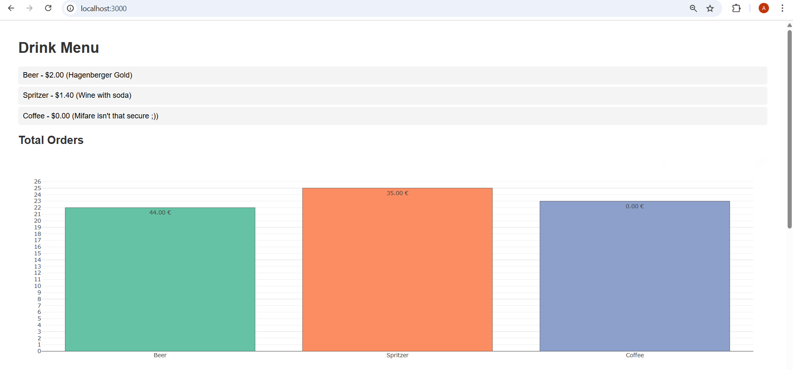
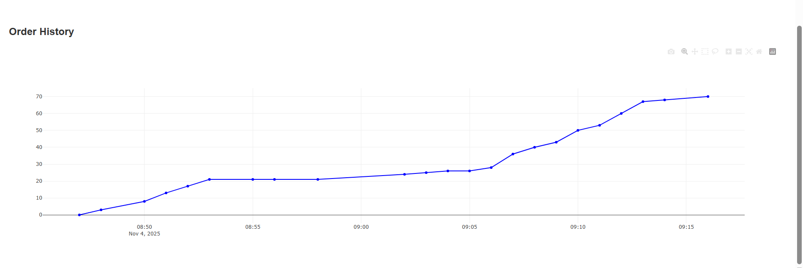
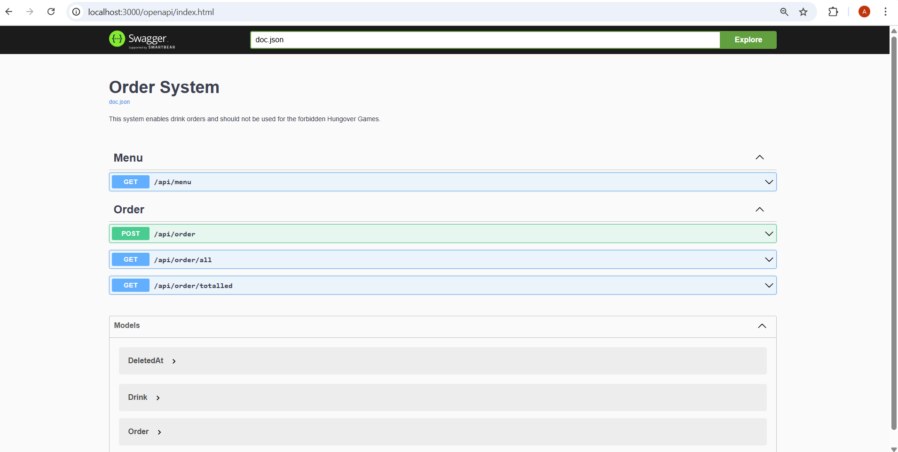

# Exercise 4: Docker Compose 🐳  

### Introduction
**What does Docker Compose do?**  
Docker Compose acts as a "project manager" for containers.  
Instead of typing multiple `docker run` commands, I can describe my setup in **one YAML file** and run:

```bash
docker compose up --build
```
This will: 
- Create a network automatically  
- Start containers in the right order (DB first)  
- Pass environment variables  
- Map ports and volumes  
- Keep everything consistent  

<br>

**Where to put the file**  
I'll create a new file in my skeleton folder, called `docker-compose.yml`.  
- This file **replaces my previous** `run.sh` file, all the steps that it did (creating network, cleaning old containers, building images, starting containers) will now be handled automatically by `docker compose up`.  
- The `debug.env` file is not longer needed -> all environment variables are included in `docker-compose.yml`.  

```lua
Ex4/skeleton/
│
├── docker-compose.yml   <-- NEW FILE
├── Dockerfile
├── scripts/
│   ├── build-openapi-docs.sh
│   └── build-application.sh
├── main.go
└── ...
```
----

### Step 1: Creating the Docker Compose file

```yaml
services:
  ordersystem-db:
    image: postgres:18                        #Use official Postgres 18 image
    container_name: ordersystem-db            #Fixed container name from EXc_3 for easy reference
    environment:
      POSTGRES_DB: order                      #Database name
      POSTGRES_USER: docker                   #DB username
      POSTGRES_PASSWORD: docker               #DB password
      PGDATA: /var/lib/postgresql/data        #Customed data directory
    volumes:
      - pgdata_sbd:/var/lib/postgresql/data
    ports:
      - "5432:5432"                           #Expose DB to host
    networks:
      - sbdnetwork                            #Join custom network

  orderservice:
    build:
      context: .                              #Build from current folder
      dockerfile: Dockerfile                  #Use provided Dockerfile
    container_name: orderservice              #Fixed container name
    environment:
      POSTGRES_DB: order                      #Match Database name
      POSTGRES_USER: docker                   #Match DB username
      POSTGRES_PASSWORD: docker               #Match DB password
      POSTGRES_TCP_PORT: 5432                 #DB port inside container
      DB_HOST: ordersystem-db                 #Connect using container name
    ports:
      - "3000:3000"                           #Expose app to host
    depends_on:
      - ordersystem-db                        #Ensure DB starts first
    networks:
      - sbdnetwork                            #Same network as DB

volumes:
  pgdata_sbd:                                 #Named volume for Postgres persistence

networks:
  sbdnetwork:                                 #Custom network for container communication
```

| Section          | Explanation      |
|----------------- |-----------------------|
| services:   | Lists all containers to run in the project |
| ordersystem-db: | Configures the PostgreSQL database container |
| image   | Specifies the Docker image to use |
| container_name  | Fixes the container name for easier reference by other containers  |
| environment   | Sets DB name, user, password, and data directory |
| volumes      | Persists database data across container restarts|
| ports         | Maps container ports to host machine ports (`5432` for Postgres)|
| networks    | Adds container to the custom network so services can communicate by name|
| orderservice:   | Configures the Go Orderservice backend container|
| build     | Builds the container using the local Dockerfile|
| environment    | Passes DB credentials and DB host to the container|
| ports     | Maps app port to host (`3000`)|
| depends_on     | Ensures Postgres container starts before Orderservice|
| networks      | Joins the same network as Postgres for container-to-container communication |
| volumes:     | Defines named volumes for persistent storage  |
| networks:  | Defines custom network configuration |

<br>

### Step 2: Dockerfile  
I reused my **multi-stage Dockerfile from** `Exc_3`
**Explanation** 
|  Stage  |  What it does   |  Why  |
|----|----|----|
|Builder|Uses `golang:1.25` image, sets `/app`, copies files, downloads modules, runs `build-application.sh` to produce `ordersystem` binary| Keeps the build isolated and caches module downloads for faster rebuilds|
|Runner|Uses lightweight `alpine:latest` image, adds non-root user, installs `ca-certificates`, copies compiled binary and frontend|Keeps final image small, secure, and contains only what’s needed to run the app|
|ENTRYPOINT|`./ordersystem`|Ensures the container starts the Go binary automatically when it runs|  

**Why multi-stage?**  
- reduces image size by not including Go compiler and source files in the final container
- improves security and portability


<br> 

### Step 3: Starting everything  

**Step 1: Navigate to project folder**  
```bash
cd /mnt/c/Public/SBD_EX/SBD-AIS-Exercise/Exc_4/skeleton
```
- In linux we need the forward slash in the path structure as well as a `mnt` (= mount)

<br>

**Step 2: Build and start containers**  
Now, instead of using my `run.sh` file, I just open my Ubuntu terminal in the project folder and run:
```bash
docker compose up --build
```
This will:  
- Build the Go app using the Dockerfile  
- Create the network automatically  
- Start both containers  
- Stream the logs directly to my terminal  

<br>

#### Visual representation of the Network:

```pgsql
   +---------------------------+
   |       orderservice        |
   |       (Go app)            |
   |---------------------------|
   | PORT: 3000                |
   | DB_HOST: ordersystem-db   |
   +-------------+-------------+
                 |
                 |  TCP connection over Docker network
                 |
   +-------------v-------------+
   |      ordersystem-db       |
   |        (PostgreSQL)       |
   |---------------------------|
   | PORT: 5432                |
   | POSTGRES_DB=order         |
   | POSTGRES_USER=docker      |
   | POSTGRES_PASSWORD=docker  |
   +---------------------------+

Network: sbdnetwork
``` 
**Explanation:**  
- `orderservice` connects to `ordersystem-db` using the **container name** `ordersystem-db`.  
- Ports are mapped to the host, so you can access the Go app on `http://localhost:3000` and Postgres on `localhost:5432`.  
- The **custom network** ensures containers can reach each other by name rather than relying on localhost.  

<br>

### Step 4: Testing in the Browser
Go to http://localhost:3000
- if I see drinks and orders -> everything works!
- Go app communicates with PostgreSQL via the shared Docker network now  




Go to http://localhost:3000/openapi/index.html
- to access the backend API


<br>

### Step 5: Stopping everything
To **stop the containers**, I run: 
```bash
docker compose down
```
<br>

To **stop and** also **remove the database volume** (delete all DB data):
```bash
docker compose down -v
```
**Note:** 
- If I run this I have to execute 
  - `./scripts/run.sh`   
  - in `/mnt/c/Public/SBD_EX/SBD-AIS-Exercise/Exc_3/skeleton` -> to create the volume again.  
- After running:  
  - `docker stop orderservice ordersystem-db` and  
  - `docker rm orderservice ordersystem-db`   
- I can switch back to   
  - `cd /mnt/c/Public/SBD_EX/SBD-AIS-Exercise/Exc_4/skeleton`   
  - and run `docker compose up --build`
<br>

## Conclusion
- The project is now fully containerized using **Docker Compose**.  
- PostgreSQL and the Go Orderservice share a network (sbdnetwork) and communicate via container names.  
- Ports are mapped correctly (3000 for the app, 5432 for DB).  
- Environment variables are self-contained in the compose file - no `debug.env` or `run.sh` needed.  
- The setup is reproducible, portable, and easy to run with one command.  