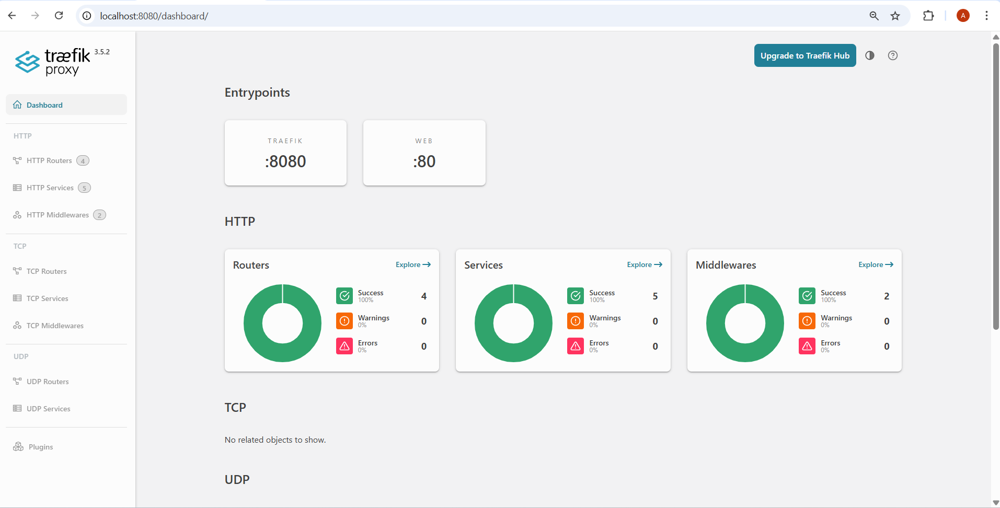
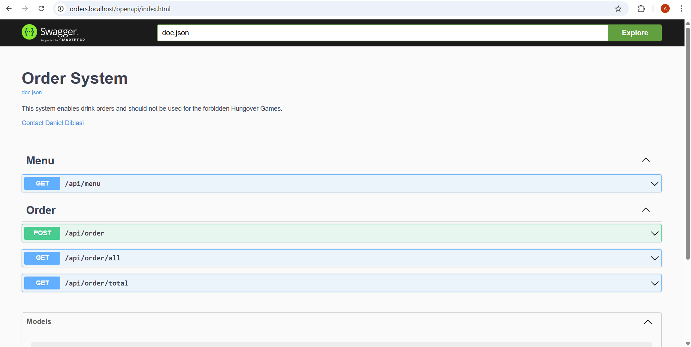
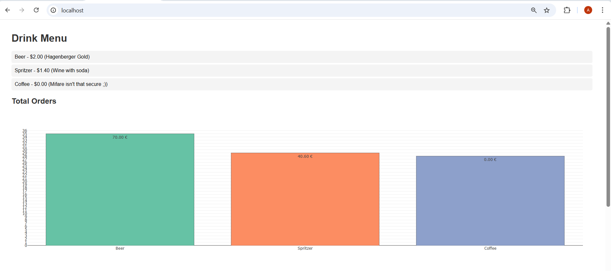
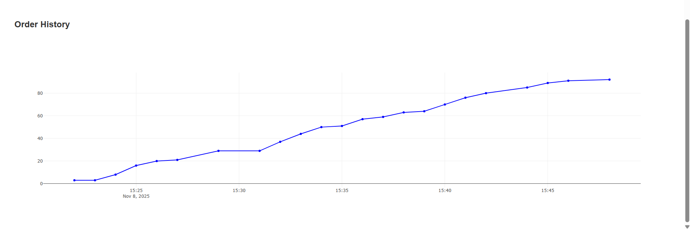
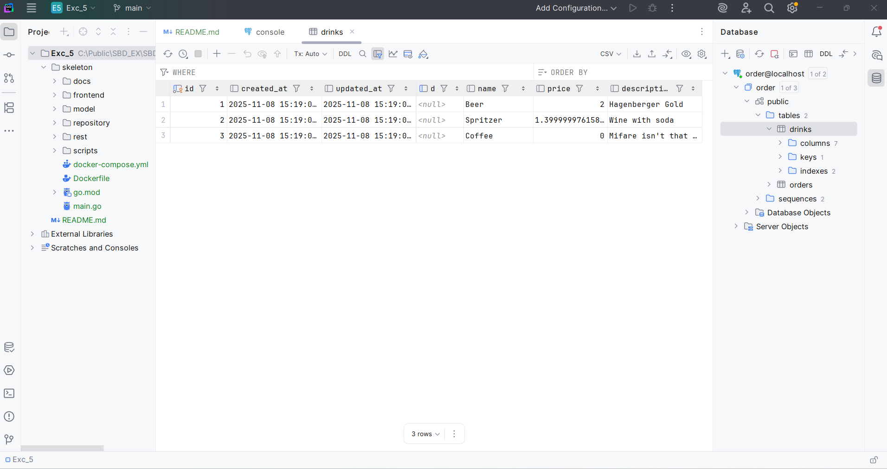
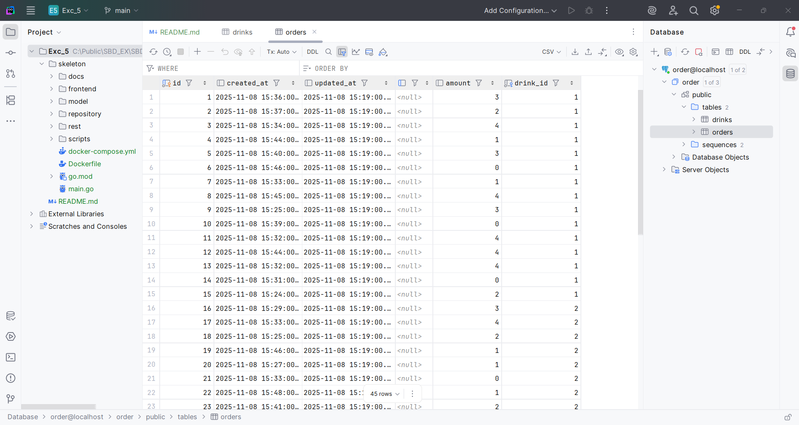
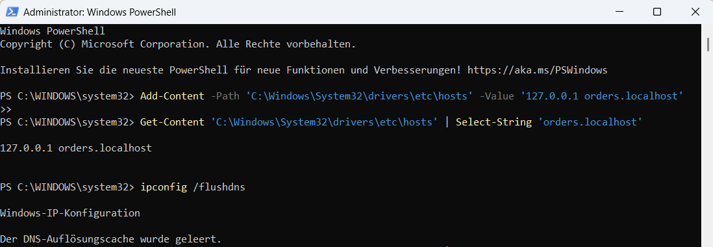
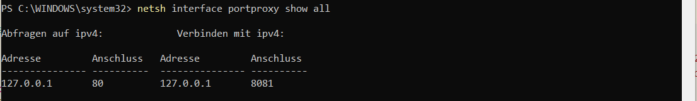
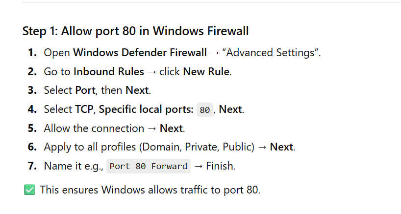
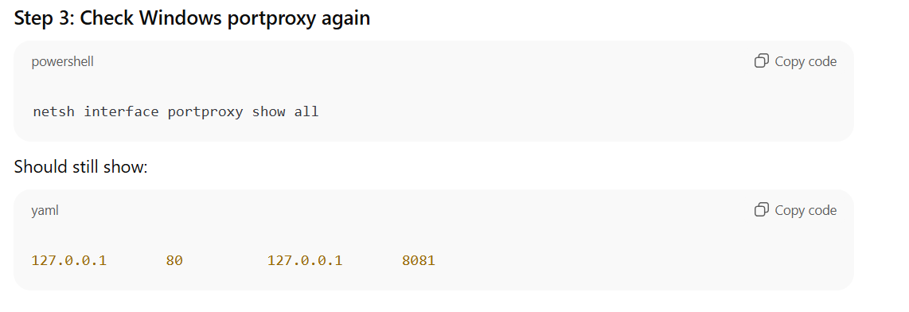

# Exercise 5: Docker Compose Setup 🐳 <br> Order Service with Traefik and Static Web Server 

This assignment deals with the setup of a containerized order management system with the following services:
- **Traefik** - reverse proxy and load balancer
- **OrderService** - backend REST API (FastAPI or Express)
- **Static Web Server (SWS)** - serves the frontend
- **PostgreSQL** - database for persistent storage

#### Final accessible URLs:
|Componenet|URL|
|----|----|
|Traefik Dashboard| http://localhost:8080/dashboard |
|Backend (OrderService)| http://orders.localhost/openapi/index.html |
| Frontend (Static Web Server)|http://localhost/|


## Step 1: Navigate to the correct Folder

```bash
cd /mnt/c/Public/SBD_EX/SBD-AIS-Exercise/Exc_5/skeleton
``` 
1.  open the **Ubuntu shell** and navigate to the correct folder

```
docker ps
```
2. **check** if any **images** are **still running** in the background  
    - in the **best case** it looks like this:

    ```bash
    CONTAINER ID   IMAGE     COMMAND   CREATED   STATUS    PORTS     NAMES
    ```

    - if there are still some images running **remove** them with 
    ```bash
    docker stop <container>
    docker rm <container>
    docker rmi <image>

    docker image prune #removes all unused (dangling) images
    ```


## Step 2: Create/Modify the `docker-compose.yml` file

### Traefik
```yaml
traefik:
    image: "traefik:v3.5.2"
    ### todo add traefik config
    ### todo only expose network web
    container_name: traefik
    command:
      #enable Traefik dashboard on :8080
      - "--api.insecure=true"
      #enables automatic Docker service discovery
      - "--providers.docker=true"
      #prevents exposure of all containers by default
      - "--providers.docker.exposedbydefault=false"
      #defines the HTTP entrypoint for routing (port 8081 inside container; 80 is taken by docker already)
      - "--entrypoints.web.address=:8081"
    ports:
      - "8081:8081" #HTTP routing entrypoint (web traffic)
      - "8080:8080" #Traefik dashboard
    volumes:
    #mounts Docker socket so Traefik can read container metadata
      - /var/run/docker.sock:/var/run/docker.sock:ro
    networks:
      - web
```
**Short Summary of the Traefik command flags:**
- `--api.insecure=true` enables the dashboard on port 8080 (only for local development)  
- `--providers.docker=true` lets Traefik read Docker labels and create routes automatically  
- `--providers.docker.exposedbydefault=false` prevents every container from automatically being exposed; we explicitly expose only those with labels  
- `--entrypoints.web.address=:80` creates the HTTP entrypoint that listens on port 80  

**Docker socket mount:**   
- Traefik must read Docker API to discover containers  
- The common path is `/var/run/docker.sock:/var/run/docker.sock:ro`   
- On Windows with Docker Desktop (like in my case) this usually works


### Orderservice
```yaml
orderservice:
    container_name: orderservice
    build: .
    #making sure the database is running before we connect
    command: ["sh", "/app/wait-for-postgres.sh"]
    depends_on:
      - order-postgres
    ### todo add traefik labels
    #to expose the service at orders.localhost -> container port 3000
    labels:
      #enables Traefik for this service
      - "traefik.enable=true"
      #uses the 'web' network for routing
      - "traefik.docker.network=web"
      #maps hostname orders.localhost -> this service
      - "traefik.http.routers.orders.rule=Host(`orders.localhost`)"
      #uses the web entrypoint
      - "traefik.http.routers.orders.entrypoints=web"
      #priority to avoid routing conflicts (technically optional)
      - "traefik.http.routers.orders.priority=10"
      #exposes internal container port 3000
      - "traefik.http.services.orders.loadbalancer.server.port=3000"
    #database credentials for log in (usually in an .env file)
    environment:
      - POSTGRES_DB=order
      - POSTGRES_USER=docker
      - POSTGRES_PASSWORD=docker
      - POSTGRES_TCP_PORT=5432
      - DB_HOST=order-postgres
    networks:
      - intercom
      - web
```
**Short summary of the orderservice labels:**  
- `traefik.enable=true` makes Traefik consider this container  
- `traefik.docker.network=web` tells Traefik which network to connect through to reach the container  
- Router rule `Host('orders.localhost')` routes requests with that Host header to this container  
- The `loadbalancer.server.port=3000` tells Traefik what internal port the Go app listens on  

#### SWS
```yaml
sws:
    image: joseluisq/static-web-server:latest
    ### todo add frontend folder as volume
    ### todo setup environment variables to expose port 80 and serve the frontend folder
    ### todo add traefik labels
    container_name: sws
    #mounts frontend folder into the container at /public (SWS default directory)
    volumes:
      - ./frontend:/public:ro
    environment:
      #tell SWS where the root folder is in the container
      - SERVER_ROOT=/public
      #exposes port 80 for static web hosting
      - SERVER_PORT=80
    labels:
      - "traefik.enable=true"
      - "traefik.docker.network=web"
      #routes 'localhost' -> frontend
      - "traefik.http.routers.sws.rule=Host(`localhost`)"
      - "traefik.http.routers.sws.entrypoints=web"
      - "traefik.http.services.sws.loadbalancer.server.port=80"
    networks:
      - web
```
**Short summary of sws service:**
- Uses `joseluisq/static-web-server` image and mounts the `./frontend` to `/public`. 
  - This is consistent with SWS docs   
  - SWS serves that content at container port 80 by default   
- Traefik labels route `Host('localhost')` to the SWS container so `http://localhost` shows the frontend  


#### Postgres
```yaml
order-postgres:
    image: postgres:18
    container_name: order-postgres
    restart: always
    networks:
      - intercom
    volumes:
      #persist database files
      - order_pg_vol:/var/lib/postgresql
    ports:
      - "55432:5432" #updated local access to DB
    environment:
      - POSTGRES_DB=order
      - POSTGRES_USER=docker
      - POSTGRES_PASSWORD=docker
      - POSTGRES_TCP_PORT=5432
```
- the only thing I changed here was the port
- previously I had **trouble connecting to** my **database** via a database viewer (specifically GoLand) -> the issue was resolved by simply changing the port


### Network Architecture
Two networks are defined to isolate traffic:
|Network| Purpose|
|----|----|
|`web`|Public-facing, used by Traefik to route HTTP requests|
|`intercom`| Internal communication between backend and database|

**This ensures:**
- Traefik can access only public-facing services.
- PostgreSQL remains hidden from the outside world.

## Step 3: Modify the `Dockerfile`

```dockerfile
#### 1: Builder

# Uses the official Go 1.25 image as the build environment
# Contains Go tools needed to compile the backend application
# AS builder names this stage so its output can be copied later
FROM golang:1.25 AS builder

#Sets the working directory inside the container to /app
#all following commands run in this directory.
WORKDIR /app

#Copies only dependency files first
#allows Docker to cache dependencies and avoid re-downloading them every build
COPY go.mod go.sum ./

#Downloads all Go module dependencies
#Speeds up later builds by reusing cached modules
RUN go mod download

#Copies the rest of the source code into the image
COPY . .

#Makes the custom build script executable and runs it
#compiles the Go project -> and creates the ordersystem binary
RUN chmod +x scripts/build-application.sh && ./scripts/build-application.sh


#### 2: Runner

#Starts a minimal, lightweight Alpine Linux image (~5 MB)
#Keeps the final image small and secure
FROM alpine:latest

#Creates a non-root user named appuser with a home directory -> improves security
RUN adduser -D -h /home/appuser appuser

#Installs required tools
  #ca-certificates -> enables HTTPS requests
  #bash -> for shell scripts (e.g., startup scripts)
  #netcat-openbsd -> used by wait-for-postgres.sh to check database availability
RUN apk add --no-cache ca-certificates bash netcat-openbsd

#Sets /app as the working directory again (in this new image)
WORKDIR /app

#Copies the compiled binary (ordersystem) from the builder stage into the runner image
#Avoids copying source code or dependencies, making the image much smaller
COPY --from=builder /app/ordersystem /app/ordersystem

#Gives file ownership to appuser and makes it executable
#Ensures proper permissions for the non-root user
RUN chown appuser:appuser /app/ordersystem && chmod +x /app/ordersystem

#Switches to appuser for running the application
#Prevents root-level access inside the container (best practice)
USER appuser


#EXPOSE doesn't actually do anything!
#Documents that the app listens on port 3000
#This doesn’t open the port; it’s just for reference and tooling
EXPOSE 3000

#Defines the command to run when the container starts
#Launches the compiled Go backend binary
ENTRYPOINT ["./ordersystem"]
```
In short this **multi-stage Dockerfile**:
- Builds the Go app in a full Golang Environment  
- Copies only the final binary into a minimal Alpine Image  
- Runs securely under a non-root user with the required Tools  
- Produces a small, production-ready container that starts the backend on port 3000


## Step 4: Create a `wait-for-postgres.sh` startup helper  
In the process of `docker compose --build` my backend crashed all the time because the database wasn't ready yet, therefore I created an additional `.sh` file to solve this issue.

```sh
#!/bin/sh
# wait-for-postgres.sh
set -e

host="$DB_HOST" #reads host from env variables
port="$POSTGRES_TCP_PORT" #reads port from env variables

echo "Waiting for Postgres at $host:$port..." #prints a status message

until nc -z "$host" "$port"; do #uses nc (netcat) to check if the port is open
  echo "Postgres is unavailable - sleeping"
  sleep 1  #repeats every second until Postgres responds
done

echo "Postgres is up - executing ordersystem"
exec /app/ordersystem
```
- `#!/bin/sh` -> runs the script using the system shell
- `set -e` -> stops the script immediately if any command fails
- `exec` replaces the shell process with the application, keeping Docker logs clean and signals handled correctly

**Purpose:**  
This ensures that the Postgres database is running before starting the Go application.
When Docker starts multiple services (like Postgres and the backend) simultaneously, the app might try to connect before the database is ready.  
This script prevents that.


## Step 5: Update the frontend `index.html`  
Originally, the fetch lines looked like this:  
```js
fetch("http://orders.localhost/api/menu")
```
That only works when the frontend (SWS) and backend are served from the same origin (same host + port).
But in my setup, they are **different services**:
- Frontend (SWS) -> served at http://localhost/
- Backend (orderservice) -> served at http://orders.localhost/openapi/index.html via Traefik

By changing to:
```js
fetch("http://orders.localhost:8081/api/menu")
fetch("http://orders.localhost:8081/api/order/totalled")
fetch("http://orders.localhost:8081/api/order/all")
```
I'm telling the browser to send requests directly to the backend domain handled by Traefik.  
Without that change, the browser would try to fetch `/api/...` from `localhost`,
which goes to SWS (the static web server) - not the Go backend.  
That would return a 404 or CORS error.  


## Step 6: Final RUN

**1. Clean up:**
```bash
docker compose down --volumes  # stop all containers and remove volumes
docker system prune -f         # optional, cleans up dangling images/layers
```
**2. Check that nothing is running:**
```bash
docker ps
```
- It should show no containers.

**3. Docker Compose:**
```bash
#individually
docker compose up -d order-postgres
docker compose up -d traefik orderservice sws

#in the background
 docker compose up --build -d
```
**4. Sanity Checks:**  
```bash
## 1. Sanity check
docker inspect -f '{{range.NetworkSettings.Networks}}{{.IPAddress}}{{end}}' order-postgres
```
- should print **172.18.0.2**

```bash
## 2. Sanity check
docker ps
```
- should output the following.
  ```bash
    CONTAINER ID   IMAGE                                COMMAND                  CREATED          STATUS          PORTS                                                             NAMES
    1c3fcdfd0d0d   traefik:v3.5.2                       "/entrypoint.sh --ap…"   4 seconds ago    Up 3 seconds    0.0.0.0:8080-8081->8080-8081/tcp, [::]:8080-8081->8080-8081/tcp   traefik
    b88a5ec7a80f   joseluisq/static-web-server:latest   "/static-web-server"     4 seconds ago    Up 3 seconds    80/tcp                                                            sws
    9484e8cc9da5   skeleton-orderservice                "./ordersystem sh /a…"   4 seconds ago    Up 3 seconds    3000/tcp                                                          orderservice
    66a1d558b5bb   postgres:18                          "docker-entrypoint.s…"   18 seconds ago   Up 18 seconds   0.0.0.0:55432->5432/tcp, [::]:55432->5432/tcp                     order-postgres
    ```

```bash
## 3. Sanity check
docker exec -it traefik sh
curl http://orders.localhost:8081/api/order/all | jq #in a more appealing format
```
- should output the content of the .jason file  

```bash
## 4. Sanity check
docker logs -f orderservice
```
- should output the following:
  ```bash
  Waiting for PostgreSQL at order-postgres:5432...
  Connection to order-postgres (172.18.0.2) 5432 port [tcp/postgresql] succeeded!
  Postgres is up! Starting application...
  2025/11/08 16:29:51 INFO Connecting to database
  2025/11/08 16:29:51 INFO ⚡⚡⚡ Order System is up and running ⚡⚡⚡
  ```

```bash
## 5. Sanity check
docker exec -it orderservice sh 

#followed by
nc -zv order-postgres 5432
```
- should print this:
  ```bash
  Connection to order-postgres (172.18.0.2) 5432 port [tcp/postgresql] succeeded!
  ```

**5. Open the Links**  
- http://localhost:8080/dashboard  

  

- http://orders.localhost/openapi/index.html  

  

- http://localhost/  

  
  

**6. Clean UP**
```bash
docker compose down
```
- run `docker compose down` for a final clean up


## Step 7: Database Connection
As mentioned before, I had troubles connecting to the database, thus I changed the port in the `.yml` file to **55432**.   
In GoLand I then mapped to **localhost:55432** and was able to view the tables again.




----
----

## Troubleshooting and Errors (only some)

**1. Containers Not Starting (orderservice not running)**
- **Symptom:** docker ps showed no running containers after docker compose up.  
- **Cause:** Go dependencies were missing inside the Docker build (missing go.sum entry for module providing package github.com/go-chi/chi/v5).  
- **Fix:**  
```bash
cd /mnt/c/Public/SBD_EX/SBD-AIS-Exercise/Exc_5/skeleton
go mod tidy
```
This downloaded all dependencies and regenerated go.sum, allowing the build to succeed.


**2. Database Connection Failures**
- **Symptom:** Backend logs showed connection errors to Postgres or startup hang.  
- **Cause:** orderservice was trying to start before Postgres was ready.  
- **Fix:** Created a startup wait script:  
  ```bash
  /app/wait-for-postgres.sh
  ```
  This script continuously checks whether Postgres is reachable before running the Go app.  


**3. Frontend (SWS) Showing “Error loading menu.”**
- **Symptom:** The frontend page loaded, but API calls failed.  
- **Cause:** Fetch URLs were using relative paths (/api/...) — causing requests to go to the wrong service (localhost instead of orders.localhost).  
- **Fix:** Updated all fetch calls in index.html:  
```js
fetch("http://orders.localhost:8081/api/menu")
fetch("http://orders.localhost:8081/api/order/totalled")
fetch("http://orders.localhost:8081/api/order/all")
```
Now routed correctly through Traefik.  

**4. Host Resolution Failure (`orders.localhost` Not Found)**
- **Symptom:** Browser couldn’t resolve orders.localhost.  
- **Cause:** Missing entry in Windows hosts file.  
- **Fix:** Added the following using PowerShell (admin mode):  
```powershell
Add-Content -Path 'C:\Windows\System32\drivers\etc\hosts' -Value '127.0.0.1 orders.localhost'
ipconfig /flushdns
```
This let Windows map `orders.localhost` -> `127.0.0.1`  

**Why orders.localhost instead of localhost?**  
Localhost is already a standard name mapped to 127.0.0.1. But we need a distinct hostname so Traefik can distinguish between:  
- Host: `localhost` -> show static frontend (sws)  
- Host: `orders.localhost` -> route to orderservice  
The hosts entry gives the orders.localhost name to the machine so the browser sends that Host header.  



**5. Windows Firewall / Defender Blocking Port 80**
- **Symptom:** Traefik and SWS containers were running, but http://localhost wouldn’t load or kept timing out.  
- **Cause:** Windows Firewall blocked port forwarding rules created by netsh.  
- **Fix:** Temporarily allowed inbound and outbound traffic for `docker-desktop-backend.exe` and `com.docker.backend.exe`.  
- Verified rules with:  
```powershell
netsh interface portproxy show all
```


Eventually the frontend was reachable via Traefik’s port 8081 instead of raw port 80.


**More information about this:**
As Administrator in Windows PowerShell
```powershell
# Forward HTTP requests from host port 80 to Traefik's port 8081
netsh interface portproxy add v4tov4 listenport=80 listenaddress=127.0.0.1 connectport=8081 connectaddress=127.0.0.1

# (Optional) For IPv6 localhost if needed)
netsh interface portproxy add v6tov4 listenport=80 listenaddress=::1 connectport=8081 connectaddress=127.0.0.1


#check rules
netsh interface portproxy show all

#remove
netsh interface portproxy delete v4tov4 listenport=80 listenaddress=127.0.0.1
netsh interface portproxy delete v6tov4 listenport=80 listenaddress=::1
```
#### Windows Defender Firewall





**6. Port Conflicts**
- **Symptom:** “Port already in use” during docker compose up.  
- **Cause:** Windows port forwarding or previous containers were still bound to 8081 or 8080.  
- **Fix:**  
```bash
docker compose down --volumes
docker system prune -f
netsh interface portproxy delete v4tov4 listenport=80 listenaddress=127.0.0.1
```
Then restarted cleanly.

----
---- 


## Summary:
This setup provides a modular, production-like container environment using Docker Compose.
It demonstrates:  
- Reverse proxy routing with Traefik  
- Service isolation via networks  
- Persistent database volumes  
- Static frontend serving  
- Automated linking between backend, frontend, and database  


