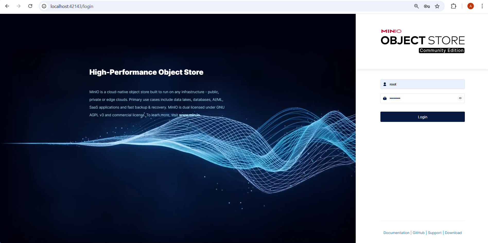
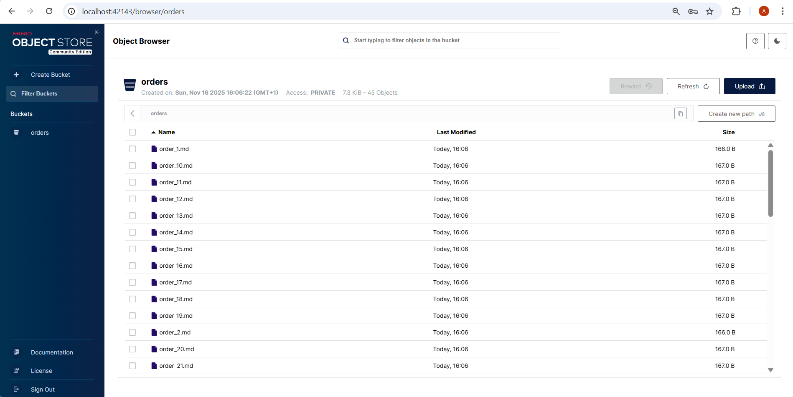
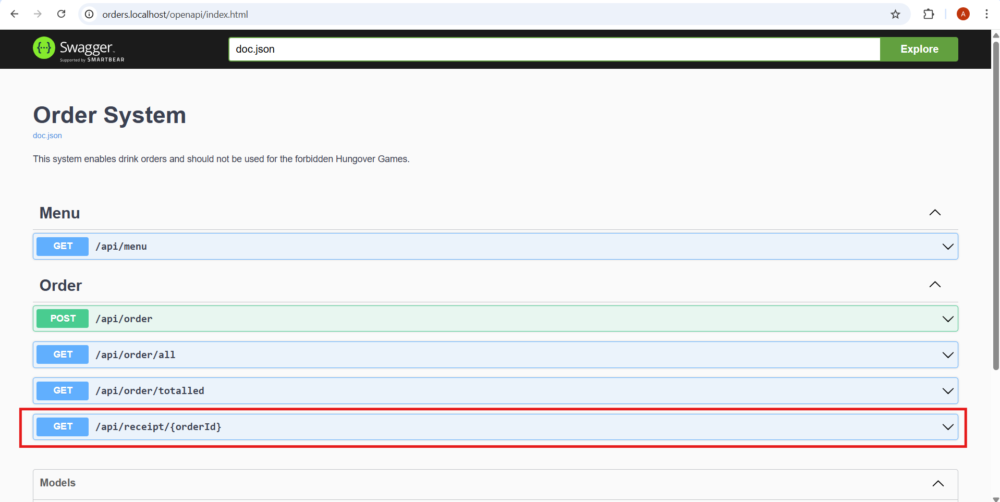
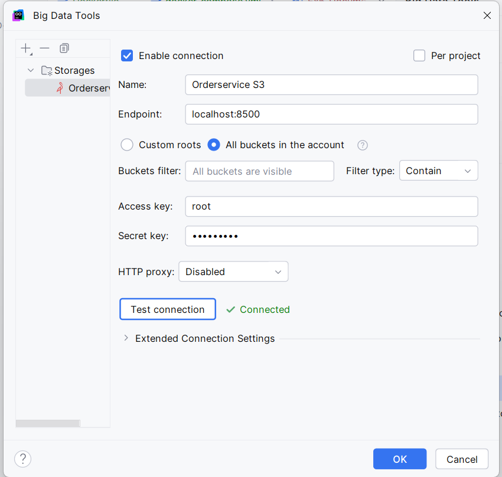
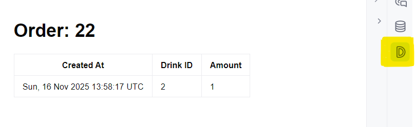

# Assignment 6: Adding Object Storage with Minio (S3)

This exercise extends the already existing Ordersystem by adding an object storage (S3 compatible, using Minio) to persist receipts for every posted drink order. 
The receipts are then stored as markdown files and can be retrieved via the API.

### Overview of the Tasks
- **Receipts** need to be stored as markdown file with order ID, creation date, drink ID, and amount
- **Docker:** `docker-compose.yml` needs to be extended to include Minio and volumes
- **Backend:** `model/order.go` and `rest/api.go` need to be updated to handle PutObject (store receipt) and GetObject (serve receipt)
- **Frontend/API access:** Backend becomes available at `orders.localhost/opena/index.html`, Minio console at `localhost:42143`
- **Development:** `debug.env` is used for local credentials, not in docker-compose.yml

### Step 1: Forking the current Exercise from the Respository
```bash
git remote -v
git fetch upstream #downloads commits from original repo without changing my branch
git checkout main #ensures I'm on my local main branch
git checkout upstream/main -- Exc_6 #copies only the exercise 5 folder into my working directory
```


### Step 2: `Dockerfile`
```dockerfile
FROM golang:1.25 AS builder
WORKDIR /app
COPY go.mod go.sum ./ 
RUN go mod download 
COPY . .
RUN sh /app/scripts/build-application.sh

FROM alpine AS run
WORKDIR /
COPY --from=builder /app/ordersystem /app/ordersystem
# EXPOSE doesn't actually do anything!
EXPOSE 3000
CMD ["/app/ordersystem"]
```
**Changes/Reasoning:**
- added `COPY go.mod go.sum ./` and `RUN go mod download` to ensure all Go dependencies are fetched during the Docker build
- This prevents missing module errors inside the Docker container


### Step 3: `docker-compose.yml`
```yaml
networks:
  web:
    name: web
  intercom:
    name: intercom

volumes:
  order_pg_vol:
  # todo
  order_minio_vol:

services:
  traefik:
    image: "traefik:v3.5.2"
    container_name: traefik
    security_opt:
      - no-new-privileges:true
    command:
      - "--providers.docker=true"
      - "--providers.docker.exposedbydefault=false"
      - "--providers.docker.network=web"
      - "--entryPoints.web.address=:80"
    ports:
      - "80:80"
      - "8080:8080"
    volumes:
      # Add Docker as a mounted volume, so that Traefik can read the labels of other services
      - "/var/run/docker.sock:/var/run/docker.sock:ro"
    networks:
      - web
    restart: unless-stopped

  orderservice:
    container_name: orderservice
    build: .
    restart: unless-stopped
    command: [ "/app/ordersystem" ]
    labels:
      - "traefik.enable=true"
      - "traefik.http.routers.orders.rule=Host(`orders.localhost`)"
      - "traefik.http.routers.orders.entrypoints=web"
      - "traefik.http.services.orders.loadbalancer.server.port=3000"
    environment:
      - POSTGRES_DB=order
      - POSTGRES_USER=docker
      - POSTGRES_PASSWORD=docker
      - PGPORT=5555
      - DB_HOST=order-postgres
      - S3_ACCESS_KEY_ID=root
      - S3_SECRET_ACCESS_KEY=topsecret
      - S3_ENDPOINT=order-minio:8500
    networks:
      - intercom
      - web

  sws:
    image: joseluisq/static-web-server:latest
    container_name: sws
    environment:
      - SERVER_PORT=80
      - SERVER_ROOT=/public
    volumes:
      - ./frontend:/public
    labels:
      - "traefik.enable=true"
      - "traefik.http.routers.sws.rule=Host(`localhost`)"
      - "traefik.http.routers.sws.entrypoints=web"
    networks:
      - intercom
      - web

  order-postgres:
    image: postgres:18
    volumes:
      - order_pg_vol:/var/lib/postgresql
    restart: always
    networks:
      - intercom
    ports:
      - "5555:5555"
    environment:
      - POSTGRES_DB=order
      - POSTGRES_USER=docker
      - POSTGRES_PASSWORD=docker
      - PGPORT=5555

  order-minio:
    # todo use minio/minio:latest as image
    image: minio/minio:latest
    container_name: order-minio
    # use the following commands: "server", "--address", ":8500", "/data"
    command: ["server", "/data", "--address", ":8500", "--console-address", ":42143"]
    # set environment variables MINIO_ROOT_USER and MINIO_ROOT_PASSWORD
    environment:
      - MINIO_ROOT_USER=root
      - MINIO_ROOT_PASSWORD=topsecret
    # map the data volume
    volumes:
      - order_minio_vol:/data
    # expose 8500
    ports:
      - "8500:8500"      # API
      - "42143:42143"    # Web console
    # add to network intercom
    networks:
      - intercom
    restart: unless-stopped
```
**Changes/Reasoning:**
- Added `order-minio` service to provide local S3-compatible storage
- Used a volume (`order_minio_vol`) to persist data
- Set `MINIO_ROOT_USER` and `MINIO_ROOT_PASSWORD` for secure access
- Exposed `8500` for API access and `42143` for the web console
- Command uses array syntax to avoid parsing issues with `command:`


### Step 4: `debug.env` (for local development)
```env
POSTGRES_DB=order
POSTGRES_USER=docker
POSTGRES_PASSWORD=docker
PGPORT=5555
DB_HOST=127.0.0.1
S3_ACCESS_KEY_ID=root
S3_SECRET_ACCESS_KEY=topsecret
S3_ENDPOINT=localhost:8500
```
**Purpose:** Better/Safer to use the credentials only in the local development.


### Step 5:  `model/order.go`
```go
package model

import (
	"fmt"
	"time"
)

const (
	orderFilename = "order_%d.md"

	// todo create markdown emplate, fields should be able to be populated with fmt.Sprintf
	markdownTemplate = `# Order: %d
	| Created At     | Drink ID | Amount |
	|----------------|----------|--------|
	| %s 		 | %d       | %d     |
	
	Thanks for drinking with us!
`
)

type Order struct {
	Base
	Amount uint64 `json:"amount"`
	// Relationships
	// foreign key
	DrinkID uint  `json:"drink_id" gorm:"not null"`
	Drink   Drink `json:"drink"`
}

func (o *Order) ToMarkdown() string {
	return fmt.Sprintf(markdownTemplate, o.ID, o.CreatedAt.Format(time.Stamp), o.DrinkID, o.Amount)
}

func (o *Order) GetFilename() string {
	return fmt.Sprintf(orderFilename, o.ID)
}
```
**Changes/Reasoning:**
- added the `markdownTemplate`
- `fmt.Sprintf` ensures correct values are injected into the markdown template
- provides a consistent filename to store and retrieve receipts from S3


### Step 6: `rest/api.go`

**Serving receipts in GetReceiptFile (retrieving an existing receipt):**

```go
		// read from s3
		// todo
		// Get the file from s3 using s3.GetObject(), the bucket name is defined in storage.OrdersBucket
		// dbOrder.Filename() can be used to get the filename.
		// handle any error!
		obj, err := s3.GetObject(
			r.Context(),
			storage.OrdersBucket,
			order.GetFilename(),
			minio.GetObjectOptions{})
		if err != nil {
			slog.Error("Unable to load the receipt from s3.", slog.String("error", err.Error()))
			render.Status(r, http.StatusInternalServerError)
			render.JSON(w, r, "Unable to load the receipt.")
			return
		}

		// serve file
		// todo
		// set the correct header on w http.ResponseWriter ("Content-Type" and "Content-Disposition")
		// Use the correct filename for "Content-Disposition" (https://developer.mozilla.org/en-US/docs/Web/HTTP/Reference/Headers/Content-Disposition)
		// io.Copy can be used to write the result of s3.GetObject() to w http.ResponseWriter
		w.Header().Set("Content-Type", "text/markdown")
		w.Header().Set("Content-Disposition", `attachment; filename="`+order.GetFilename()+`"`)

		if _, err := io.Copy(w, obj); err != nil {
			slog.Error("Unable to write receipt to response", slog.String("error", err.Error()))
		}
```

**Adding the receipt storage to PostOrder (creating a new order):**

```go
        // store to s3
		// todo
		// call dbOrder.ToMarkdown() --> use strings.NewReader to create a reader
		// Put the file into s3 using s3.PutObject(), the bucket name is defined in storage.OrdersBucket
		// dbOrder.Filename() can be used to get the filename.
		// Size of the file is determined by the string.
		// Use the following PutObjectOptions: minio.PutObjectOptions{ContentType: "text/markdown"}
		// Handle errors!
		md := dbOrder.ToMarkdown()
		reader := strings.NewReader(md)

		_, err = s3.PutObject(
			r.Context(),
			storage.OrdersBucket,
			dbOrder.GetFilename(),
			reader,
			int64(len(md)),
			minio.PutObjectOptions{ContentType: "text/markdown"},
		)
		if err != nil {
			slog.Error("Unable to upload receipt to S3", slog.String("error", err.Error()))
			render.Status(r, http.StatusInternalServerError)
			render.JSON(w, r, "Unable to upload receipt to S3")
			return
		}
```
**Explanation:**
- `PutObject` stores the markdown file in Minio immediately after the order is created using the order ID as filename
- `GetObject` retrieves the receipt and serves it to the client upon request with proper headers
- `Content-Disposition` ensures the file is downloaded with the correct filename rather than displayed inline
- This workflow guarantees every order has a corresponding receipt in S3 and can be retrieved independently of the database.


### Step 7: Building and running
```bash
cd /mnt/c/Public/SBD_EX/SBD-AIS-Exercise/Exc_6/skeleton
docker compose down -v
docker system prune -f
docker ps # should be empty
#go mod tidy
docker compose up -d
```

### Step 8: Check Services and URLs
✔ **Frontend API** reachable at: http://localhost/  
✔ **Minio Console** reachable at: http://localhost:42143/login and http://localhost:8500  
✔ **Swagger Backend** reachable at: http://orders.localhost/openapi/index.html  

#### Frontend


#### Minio Console



#### Backend


### Step 9: Viewing S3 Files 
- I use the Remote File System plugin in Goland -> simply downloaded the version for it and added it in my IDE
- Credentials are used from the from debug.env (doubled checked with the provided template)
- Allows browsing receipts directly from the IDE  



**Sample Receipt:**


### Step 10: Committing to Github
```bash
git add .
git commit -m "Exc_6: Added Minio S3 object storage with receipt functionality"
git push origin main
``` 