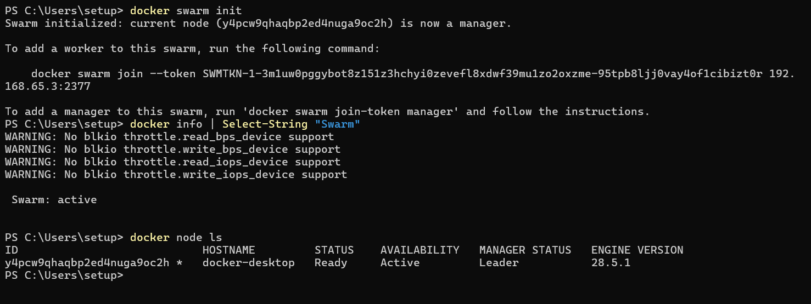
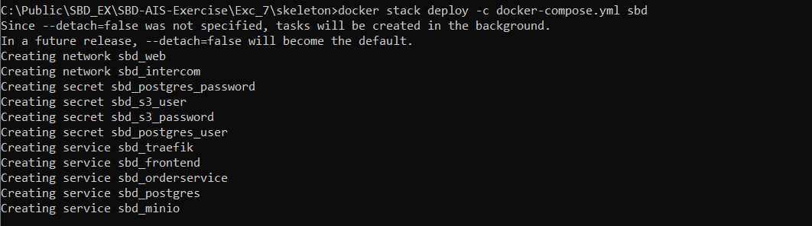
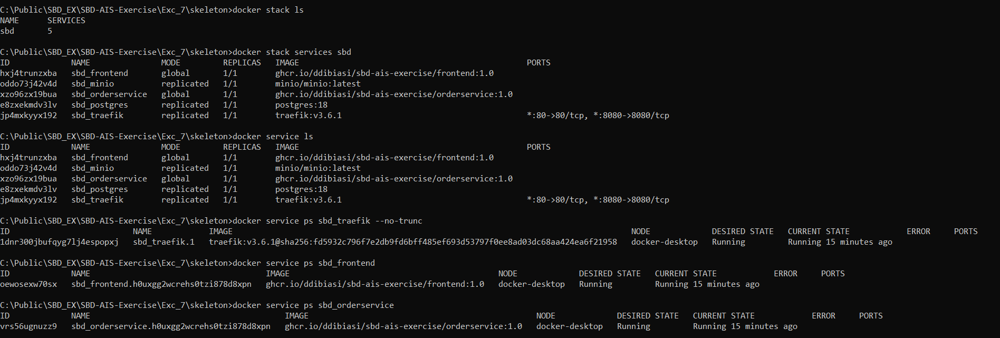

# Exercise 7: Docker Swarm on my Local Machine 🐳🐳🐳

With this documentation I'll explain how I deployed the **SBD AIS Exercise** application on my local machine using Docker Swarm.  

The deployment consists of five services:  
- Traefik (reverse proxy / router)  
- Frontend (static web server)  
- OrderService (Go backend)  
- PostgreSQL (database)  
- MinIO (S3-compatible object store)  

Everything runs on a **single-node Swarm cluster** using Docker Desktop.


### Overview   
The goal of this exercise was to containerize all application components, configure their networking, secure credentials using Docker Secrets, and deploy them using `docker stack deploy`.  

What I implemented
- Enabled Swarm mode
- Created overlay networks
- Created Docker Secrets for Postgres and MinIO
- Configured Traefik as an ingress controller
- Deployed all services using a Swarm-ready docker-compose.yml
- Routed two public domains:
  - http://localhost -> Frontend
  - http://orders.localhost -> OrderService

### Architecture Overview
This stack uses two Docker Swarm overlay networks:  

|Network|Purpose|
|----|----|
|web|Public traffic routed by Traefik|
|intercom|Internal backend communication|

Persistent data is stored using volumes:
- `order_pg_vol` -> PostgreSQL database
- `minio_vol` -> MinIO object storage

Sensitive credentials are handled via Swarm secrets:
- Postgres user
- Postgres password
- S3/MinIO access key
- S3/MinIO secret key

### Folder Structure

```md
EXC_7/
├── skeleton/
│   ├── docker/
│   │   ├── orderservice.Dockerfile
│   │   ├── postgres_password_secret
│   │   ├── postgres_user_secret
│   │   ├── s3_password_secret
│   │   └── s3_user_secret
│   ├── sws.Dockerfile
│   └── docs/...
│
├── repository/
├── rest/
├── scripts/
├── secrets/
├── storage/
├── docker-compose.yml
├── main.go
└── README.md
```


## 1. The Swarm-Ready `docker-compose.yml`
It uses the existing secret files in skeleton/docker/ and sets Traefik routing (no TLS), global services for frontend & orderservice, and single-replica postgres/minio pinned to the manager (single node):

```yaml
networks:
  web:
    driver: overlay
    attachable: true
  intercom:
    driver: overlay
    attachable: true

volumes:
  order_pg_vol:
  minio_vol:

secrets:
  postgres_user:
    file: docker/postgres_user_secret
  postgres_password:
    file: docker/postgres_password_secret
  s3_user:
    file: docker/s3_user_secret
  s3_password:
    file: docker/s3_password_secret

services:
  traefik:
    image: traefik:v3.6.1
    command:
      - --api.insecure=false
      - --api.dashboard=true
      - --providers.swarm=true
      - --providers.docker.exposedbydefault=false
      - --entrypoints.web.address=:80
      - --log.level=INFO
    ports:
      - target: 80
        published: 80
        protocol: tcp
        mode: ingress
      #added for dashboard access
      - target: 8080
        published: 8080
        protocol: tcp
        mode: ingress
    volumes:
      - /var/run/docker.sock:/var/run/docker.sock:ro # Traefik reads Swarm API
    networks:
      - web
      - intercom #added to allow traefik to route to orderservice
    # todo
    # Replicate only to manager
    # expose dashboard to localhost/dashboard
    deploy:
      replicas: 1
      placement:
        constraints:
          - node.role == manager
      labels:
        - traefik.enable=true
        - traefik.http.routers.traefik-dashboard.rule=Host(`localhost`) && PathPrefix(`/dashboard`)
        - traefik.http.routers.traefik-dashboard.entrypoints=web
        - traefik.http.services.traefik-dashboard.loadbalancer.server.port=80

  frontend:
    image: ghcr.io/ddibiasi/sbd-ais-exercise/frontend:1.0
    networks:
      - web
    # todo deploy globally
    # should be available at http://localhost from every node
    deploy:
      mode: global
      labels:
        - traefik.enable=true
        # Make frontend available at http://localhost
        - traefik.http.routers.frontend.rule=Host(`localhost`)
        - traefik.http.routers.frontend.entrypoints=web
        - traefik.http.services.frontend.loadbalancer.server.port=80
      restart_policy:
        condition: on-failure

  orderservice:
    image: ghcr.io/ddibiasi/sbd-ais-exercise/orderservice:1.0
    command: [ "/app/ordersystem" ]
    networks:
      - web
      - intercom
    # todo use secrets
    secrets:
      - postgres_user
      - postgres_password
      - s3_user
      - s3_password
    # todo use secrets
    environment:
      - DB_HOST=postgres
      - PGPORT=5432
      - POSTGRES_DB=order
      - POSTGRES_USER_FILE=/run/secrets/postgres_user
      - POSTGRES_PASSWORD_FILE=/run/secrets/postgres_password
      - S3_ENDPOINT=minio:8500
      - S3_ACCESS_KEY_ID_FILE=/run/secrets/s3_user
      - S3_SECRET_ACCESS_KEY_FILE=/run/secrets/s3_password
    # todo deploy global
    # Should be reachable at http://orders.localhost
    deploy:
      mode: global
      labels:
        - traefik.enable=true
        - traefik.http.routers.orders.rule=Host(`orders.localhost`)
        - traefik.http.routers.orders.entrypoints=web
        - traefik.http.services.orders.loadbalancer.server.port=3000
      restart_policy:
        condition: any
        delay: 5s
        max_attempts: 10
        window: 60s

  postgres:
    image: postgres:18
    volumes:
      - order_pg_vol:/var/lib/postgresql
    networks:
      - intercom
    # todo use secrets
    secrets:
      - postgres_user
      - postgres_password
    # todo use secrets
    environment:
      - POSTGRES_DB=order
      - POSTGRES_USER_FILE=/run/secrets/postgres_user
      - POSTGRES_PASSWORD_FILE=/run/secrets/postgres_password
      - PGPORT=5432
    # todo replicate only to one worker node
    # todo use constraints
    deploy:
      replicas: 1
      placement:
        constraints:
          - node.role == manager
      restart_policy:
        condition: on-failure

  minio:
    image: minio/minio:latest
    command: [ "server", "--address", ":8500", "/data" ]
    volumes:
      - minio_vol:/data
    networks:
      - intercom
    # todo use secrets
    secrets:
      - s3_user
      - s3_password
    # todo use secrets
    environment:
      - MINIO_ROOT_USER_FILE=/run/secrets/s3_user
      - MINIO_ROOT_PASSWORD_FILE=/run/secrets/s3_password
    # todo replicate only to one worker node
    # todo use constraints
    deploy:
      replicas: 1
      placement:
        constraints:
          - node.role == manager
      restart_policy:
        condition: on-failure
```

**Why these choice:**
- `mode: global` for `frontend` and `orderservice` so they run once on every node - in single-node Swarm they will run on that node (same as assignment requirement)
- `postgres` and `minio` are single replicas and pinned to `node.role == manager` because you only have one node - this satisfies “one replica of DB and Minio”
- Constraint: manager -> ensures they run on my single node
- Secrets are used as files `(/run/secrets/...)` so no sensitive data ends up in environment variables
- Traefik labels are placed under `deploy.labels` (Swarm requires labels inside `deploy` for services in stacks)
- Routing: `localhost` for frontend, `orders.localhost` for orders 

## 2. Setting up Docker Swarm
  **Important:** I run PowerShell as Administrator for firewall edits and hosts file editing steps.   

  Before deploying the stack, I enabled Swarm mode:
  ```powershell
  docker swarm init

  #veryfying that it is active
  docker info | Select-String "Swarm"
  docker node ls
  ```
  **Expected Result:** The Docker Desktop node appears as a single manager.  
  
  

## 3. Creating Docker secrets
  I created the secrets from the provided secret files inside `skeleton/docker/`.

  ```powershell
  # navigate to the right folder
  cd C:\Public\SBD_EX\SBD-AIS-Exercise\Exc_7

  # run in root/ (repo root). Adjust path if your repo is elsewhere.
    docker secret create postgres_user .\skeleton\docker\postgres_user_secret
    docker secret create postgres_password .\skeleton\docker\postgres_password_secret
    docker secret create s3_user .\skeleton\docker\s3_user_secret
    docker secret create s3_password .\skeleton\docker\s3_password_secret
  ```
  **Why:**   
  - these commands register secrets so containers can read them directly at `/run/secrets/<name>` (they're mounted)
  - they never appear in environment variables or logs

## 4. Deploying the Stack 
  Make sure `docker-compose.yml` already contains the new content.   
  Then:

  ```powershell
  # nagivate to skeleton
  cd C:\Public\SBD_EX\SBD-AIS-Exercise\Exc_7\skeleton

  # create the swarm
  docker stack deploy -c docker-compose.yml sbd
  ```
  **Why:**   
  - `docker stack deploy` creates 
    - services
    - secrets
    - overlay networks
    - persistent volumes  
    in Swarm using the Compose file.   
  - The stack name here is `sbd`.

  **Output** should look like this:  
  

## 5. Check progress & service status (Verify that everything is running)
  Running these commands in the PowerShell we can inspect the services:

  ```powershell
  docker stack ls
  docker stack services sbd
  docker service ls

  #for details per service
  docker service ps sbd_traefik --no-trunc
  docker service ps sbd_frontend
  docker service ps sbd_orderservice
  ```
  **Why:** verify services were created and tasks are running;`--no-trunc` shows full node/task IDs 
  - These help check:  
    - whether replicas are running  
    - if placement constraints were respected  
    - whether services restarted due to dependency timing issues

  **Output** should look like this:  
  

  **Shows that:** 
  - Swarm is up and running (single-node).
  - The docker stack ls shows the stack sbd with all 5 services.
  - The docker service ls confirms that frontend, postgres, minio, and traefik are running 1 replica each, which is exactly what I want for a single-node setup.
  - Traefik is listening on port 80 (*:80->80/tcp) → the frontend should be accessible at http://localhost.


## 6. Testing
  **Frontend**
  ```powershell
  curl http://localhost/
  ```
  - This should return the frontend HTML.


## 7. Restart or updating the Stack
  ```powershell
  #to redeploy
  docker stack deploy -c docker-compose.yml sbd

  #Force a restart of OrderService only
  docker service update --force sbd_orderservice
  
  #Remove the stack
  docker stack rm sbdc
  ```

## 8. Shut down Swarm mode
For disabling Swarm and shut it down entirely: 
```powershell
  docker swarm leave --force
```
- This returns Docker to normal “single engine” mode.


## 8. Summary
At the end of this exercise:
- I deployed a full microservice application on a local Swarm cluster.
- I used Swarm Secrets, overlay networks, volumes, and Traefik routing.
- I successfully exposed:
  - Frontend → http://localhost  

All five services run cleanly and are reachable through Traefik.


