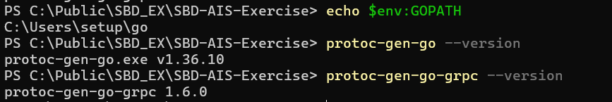
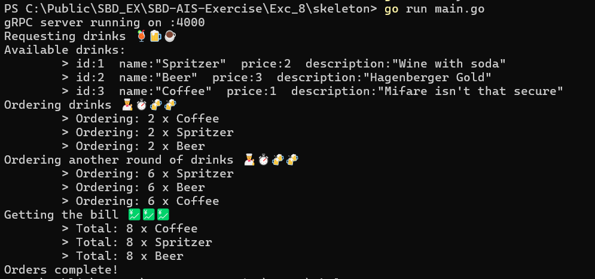

# Exercise 8: gRPC Client & Server in Go

The goal of this exercise is to implement a gRPC client and server in Go. The client interacts with a prepopulated set of drinks, orders them, and retrieves the aggregated totals. All orders are stored **in memory**, no database is needed.


### Overview of Tasks
1. Install `protoc` and Go gRPC plugins
2. Define your protobuf messages and service in `pb/orders.proto`
3. Generate Go code from the `.proto` file
4. Implement the server and client 
5. Implement the main.go file
Run the server in a goroutine and execute the client

## Step 1: Prerequisite - Install `protoc`

**Link:** https://protobuf.dev/installation/
 - Windows, using [Winget](https://learn.microsoft.com/en-us/windows/package-manager/winget/)
```powershell
> winget install protobuf
> protoc --version # Ensure compiler version is 3+
 ```


Install Go plugins for protobuf:
```powershell
go install google.golang.org/protobuf/cmd/protoc-gen-go@latest
go install google.golang.org/grpc/cmd/protoc-gen-go-grpc@latest
```
Sanity checks:
```powershell
echo $env:GOPATH
protoc-gen-go --version
protoc-gen-go-grpc --version
```


## Step 2: Define Protobuf Messages (`pb/orders.proto`)

The protobuf file defines the **data structures** **(messages)** and the **RPC service**.

| Message        | Purpose                                                              | Explanation                                          |
| -------------- | -------------------------------------------------------------------- | ---------------------------------------------------- |
| `Drink`        | Represents a drink item.                                             | Each drink has `id`, `name`, `price`, `description`. |
| `DrinkList`    | Used when returning all available drinks.                            | A repeated list of `Drink` messages.                 |
| `OrderItem`    | One drink order with quantity.                                       | Used to store the quantity of a specific drink.      |
| `OrderRequest` | Sent by client when ordering drinks (contains a single `OrderItem`). | Wraps one `OrderItem` for RPC requests.              |
| `AllOrders`    | Stores all orders made so far.                                       | Used to return all orders for aggregation.           |


| RPC          | Input          | Output      | Description                     | Explanation                                                      |
| ------------ | -------------- | ----------- | ------------------------------- | ---------------------------------------------------------------- |
| `GetDrinks`  | `Empty`        | `DrinkList` | Returns all preloaded drinks.   | Allows the client to list all drinks without sending parameters. |
| `OrderDrink` | `OrderRequest` | `BoolValue` | Stores a drink order in memory. | Returns `true` to confirm the order was successfully stored.     |
| `GetOrders`  | `Empty`        | `AllOrders` | Returns all orders made so far. | Allows the client to calculate totals for all drinks ordered.    |

**Explanation:**   
- Using `google.protobuf.Empty` allows sending requests without data   
- `google.protobuf.BoolValue` is used for returning a boolean result


## Step 3: Generate the Go code
From the project root (`Exc_8\skeleton`):
```powershell
cd C:\Public\SBD_EX\SBD-AIS-Exercise\Exc_8\skeleton
protoc --go_out=. --go-grpc_out=. pb/orders.proto
```
- This generates `pb/order.pb.go` and `pb/order_grpc.pb.go` (in pb inside exc8) for server and client usage.

**Explanation:** These generated files include Go structs for messages and interfaces for the gRPC service.


## Step 4: Server Implementation (`server/server.go`)
The server implements `OrderServiceServer` and stores orders **in memory**:

```go
type GRPCService struct {
    pb2.UnimplementedOrderServiceServer
}
```
- **Preloaded drinks** are defined at startup:
```go
var drinks = []*pb2.Drink{
    {Id: 1, Name: "Spritzer", Price: 2, Description: "Wine with soda"},
    {Id: 2, Name: "Beer", Price: 3, Description: "Hagenberger Gold"},
    {Id: 3, Name: "Coffee", Price: 1, Description: "Mifare isn't that secure"},
}
```
- Orders are appended to a slice of `OrderItem` in memory.
- **Functions:**  

| Function     | Purpose                            | Explanation                                       |
| ------------ | ---------------------------------- | ------------------------------------------------- |
| `GetDrinks`  | Returns the preloaded drinks       | Client can list drinks available.                 |
| `OrderDrink` | Appends an order to `orders` slice | No database is needed; all orders stay in memory. |
| `GetOrders`  | Returns all orders                 | Allows client to aggregate totals.                |
  

## Step 5: Client implementation (`client/grpc_client.go`)

The client performs tasks sequentially:
1. List drinks
2. Order a first round
3. Order a second round
4. Get total orders

**Why maps are used:** Using `map[int32]int32` allows easy aggregation of quantities by `DrinkId`.

Key steps:
```go
grpcClient, err := client.NewGrpcClient()
if err != nil {
    log.Fatalf("Failed to create gRPC client: %v", err)
}
grpcClient.Run()
```

#### Output should look like the following:
```shell
gRPC server running on :4000
Requesting drinks 🍹🍺☕
Available drinks:
        > id:1  name:"Spritzer"  price:2  description:"Wine with soda"
        > id:2  name:"Beer"  price:3  description:"Hagenberger Gold"
        > id:3  name:"Coffee"  price:1  description:"Mifare isn't that secure"
Ordering drinks 👨‍🍳⏱️🍻🍻
        > Ordering: 2 x Coffee
        > Ordering: 2 x Spritzer
        > Ordering: 2 x Beer
Ordering another round of drinks 👨‍🍳⏱️🍻🍻
        > Ordering: 6 x Spritzer
        > Ordering: 6 x Beer
        > Ordering: 6 x Coffee
Getting the bill 💹💹💹
        > Total: 8 x Coffee
        > Total: 8 x Spritzer
        > Total: 8 x Beer
Orders complete!
```
**Explanation:**   
The server logs each order, while the client prints a user-friendly output. Totals are computed by summing quantities for each drink.


## Step 5: Main (`main.go`)
```go
package main

import (
	"exc8/client"
	"exc8/server"
	"log"
	"time"
)

func main() {
	// Start server in a goroutine
	go func() {
		if err := server.StartGrpcServer(); err != nil {
			log.Fatalf("Failed to start gRPC server: %v", err)
		}
	}()

	// Give server time to start
	time.Sleep(1 * time.Second)

	// Start client
	grpcClient, err := client.NewGrpcClient()
	if err != nil {
		log.Fatalf("Failed to create gRPC client: %v", err)
	}
	if err := grpcClient.Run(); err != nil {
		log.Fatalf("Client run failed: %v", err)
	}

	println("Orders complete!")
}
```
**Explanation:**
- The server runs concurrently using a goroutine
- `time.Sleep` ensures the server is ready before the client starts
- All output appears in the console


## Step 6: Build and Run
From `Exc_8\skeleton` I run:
```powershell
#Ensure Go modules are tidy
go mod tidy

#Run the program
go run main.go
```
- The **server** starts in a goroutine.
- The **client** runs immediately after.
- All output is printed in the console.

**Note:** No static website or files are opened. The program is purely **gRPC client-server in console**.

### Final Output


