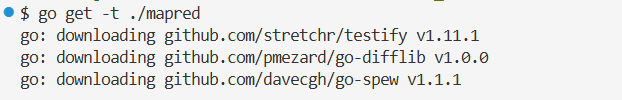
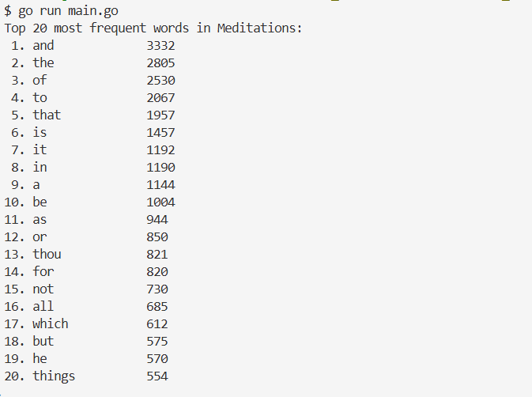

# Exercise 9: MapReduce for Word Counting 📊

In this assignment I implement a mini **MapReduce framework** for **word counting**.  

### Introduction
Conceptually the MapReduce has **three phases**:  
1. **Map:**
   - **Input**: Raw text data
   - **Process**: Transform text into `(key, value)` pairs
   - **Example (Word Count)**: `(word, 1)`
2. **Shuffle/Group**
   - Group values by key
   - Example:
     ```arduino
     ("this", 1), ("this", 1) → "this": [1,1]
     ```
3. **Reduce**
   - Aggregate values per key
   - For word count: sum the integers

I will implement all three, concurrently and locally in GO.

#### My Folder Structure:

```go
skeleton/
└── docs/
    └── Ex9_Documentation.md
└── mapred/
    ├── interface.go
    ├── map_reduce_test.go
    ├── map_reduce.go   <-- I implement everything here
└── res/
    └── meditations.txt
├── go.mod
├── go.sum
├── main.go
└── README.md
```
The `interface.go` tells me exactly what functions must exist in my code and how they behave.


## Step 1: Define the `MapReduce` type
The tests already do `var mr MapReduce`, so I define: 
  ```go
  type MapReduce struct {}
  ```

## Step 2:  Implemention the Mapper
The goal is to convert **one string** into a slice of `(word, 1)` pairs.

**Important Requirements:**
- Case insensitive (`"This"` -> `"this"`)
- Remove:
    - special characters
    - numbers
- Split by whitespace
- Return one `KeyValue` **per word occurrence**

```go
func (mr MapReduce) wordCountMapper(text string) []KeyValue {
	//Converting everything to lowercase to make the counting case-insensitive
	text = strings.ToLower(text)

	//Regex: keeping only letters and spaces
	re := regexp.MustCompile(`[^a-z\s]`) //remove everything that is NOT a letter or whitespace
	cleanText := re.ReplaceAllString(text, "")

	//Split text into words
	words := strings.Fields(cleanText)

	//Create key-value pairs
	var result []KeyValue
	for _, word := range words {
		result = append(result, KeyValue{Key: word, Value: 1})
	}
	return result
}
```

## Step 3: Implement the Reducer
The goal is that it takes e.g. `("test", []int{1,1})` and returns -> `("test", 2)`.  

**Why:** The reducer aggregates the values belonging to the same key.

```go
func (mr MapReduce) wordCountReducer(key string, values []int) KeyValue {
	sum := 0
	for _, v := range values {
		sum += v
	}
	return KeyValue{Key: key, Value: sum}
}
```

## Step 4: Implementing the `RUN` (full MapReduce pipeline)
This is the core of the exercise.  

**Phase 1 - MAP (concurrent)**  
- Each input string is processed in **parallel**
- Each mapper emits `[]KeyValue`
- All results are sent into a channel

**Phase 2 - SHUFFLE/GROUP**  
- Group values by key: 
    ```go
    map[string][]int
    ```

**Phase 3 - REDUCE (concurrent)**  
- Each key is reduced in **parallel**
- Output is collected into final result map

```go
func (mr MapReduce) Run(input []string) map[string]int {
	//Channel to collect mapper outputs
	mapChan := make(chan []KeyValue)

	var mapWg sync.WaitGroup

	//MAP PHASE
	for _, text := range input {
		mapWg.Add(1)

		//Each input line is processed concurrently
		go func(t string) {
			defer mapWg.Done()
			mapChan <- mr.wordCountMapper(t)
		}(text)
	}

	//Close channel once all mappers are done
	go func() {
		mapWg.Wait()
		close(mapChan)
	}()

	//SHUFFLE/GROUP PHASE
	grouped := make(map[string][]int)

	for kvSlice := range mapChan {
		for _, kv := range kvSlice {
			grouped[kv.Key] = append(grouped[kv.Key], kv.Value)
		}
	}

	//REDUCE PHASE
	result := make(map[string]int)
	var reduceWg sync.WaitGroup
	var mu sync.Mutex

	for key, values := range grouped {
		reduceWg.Add(1)

		go func(k string, v []int) {
			defer reduceWg.Done()
			kv := mr.wordCountReducer(k, v)

			//Protect shared map with mutex
			mu.Lock()
			result[kv.Key] = kv.Value
			mu.Unlock()
		}(key, values)
	}

	reduceWg.Wait()
	return result
}
```

## Step 5: Test RUN

First, I need to run this command from the module root (`Exc_9/skeleton`, where `go.mod` lives), to istall the test dependencies (`-t`), download `testify`and update `go.sum`with verified checksums:   

```bash
go get -t ./mapred

#or also possible
go mod tidy
```
  


Now I can run the tests:
```bash
go test ./mapred
```


### Design Decisions
- Each input line is processed by a separate mapper goroutine to maximize parallelism.
- A channel is used to collect mapper output in a thread-safe way.
- The shuffle phase groups values by key using a map.
- Reducers run concurrently and write to the result map using a mutex to avoid data races.
- Regular expressions are used to reliably remove non-alphabetic characters.


## Step 6: Implement `main.go`

```go
func main() {
	//STEP 1: Open the input file
	//open meditations.txt from the res/ folder
	file, err := os.Open("res/meditations.txt")
	if err != nil {
		//if the file cannot be opened, log an error and exit.
		log.Fatalf("failed to open file: %v", err)
	}
	defer file.Close()

	//STEP 2: Read the file line by line
	//each line of text will become an element in a slice of strings
	//this slice will be the input for MapReduce
	var text []string
	scanner := bufio.NewScanner(file)
	for scanner.Scan() {
		text = append(text, scanner.Text())
	}
	if err := scanner.Err(); err != nil {
		log.Fatalf("error reading file: %v", err)
	}

	//STEP 3: Run the MapReduce word count
	//create a MapReduce instance and call Run on the input text
	var mr mapred.MapReduce
	results := mr.Run(text)
	//'results' is a map[string]int where the key is the word and the value is the frequency

	//STEP 4: Sort results for readability
	//sort words by frequency in descending order
	//helps to see the most common words first
	type wordCount struct {
		Word  string
		Count int
	}

	var sorted []wordCount
	for word, count := range results {
		sorted = append(sorted, wordCount{word, count})
	}

	//Sort slice by Count descending
	sort.Slice(sorted, func(i, j int) bool {
		return sorted[i].Count > sorted[j].Count
	})

	//STEP 5: Print the results
	//print the top 20 most frequent words
	fmt.Println("Top 20 most frequent words in Meditations:")
	for i := 0; i < 20 && i < len(sorted); i++ {
		fmt.Printf("%2d. %-15s %d\n", i+1, sorted[i].Word, sorted[i].Count)
	}
}
```
### Explanation
**Step 1 - Open the file**
- Use `os.Open` to read `meditations.txt`
- `defer file.Close()` ensures automatic file closure when the program ends
- **Why**: must load the input text to run MapReduce operations

**Step 2 - Read file line by line**
- Use `bufio.Scanner` for efficient line-by-line reading
- Each line becomes a string in a slice
- **Why**: Independent line processing enables concurrent mapper goroutines

**Step 3 - Run MapReduce**
1. Create a `MapReduce` instance
2. Call `mr.Run(text)` to execute:
   - **Map Phase**: Convert lines into `(word, 1)` pairs concurrently
   - **Shuffle Phase**: Group counts by word
   - **Reduce Phase**: Sum counts concurrently
3. **Output**: `map[string]int` containing word frequencies

**Step 4 - Sort results**
- **Challenge**: Map keys are unordered in Go
- **Solution**: 
  - Convert map to slice of `wordCount` structs
  - Sort by `Count` descending using `sort.Slice`
- **Why**: Makes the most frequent words immediately visible

**Step 5 - Print results**
- Display only the top 20 words
- Formatting: `%-15s` ensures proper column alignment
- **Why**: Provides a clear, readable summary of word frequencies

## Step 7: Run `main.go`
From the root (`/c/Public/SBD_EX/SBD-AIS-Exercise/Exc_9/skeleton`) I run:
```bash
go run main.go

#to save my results
go run main.go > docs/results.txt
```
### Output

- **For the Top 20:**  
      

- **For the Top 50:**  
   see `docs/results.txt`


